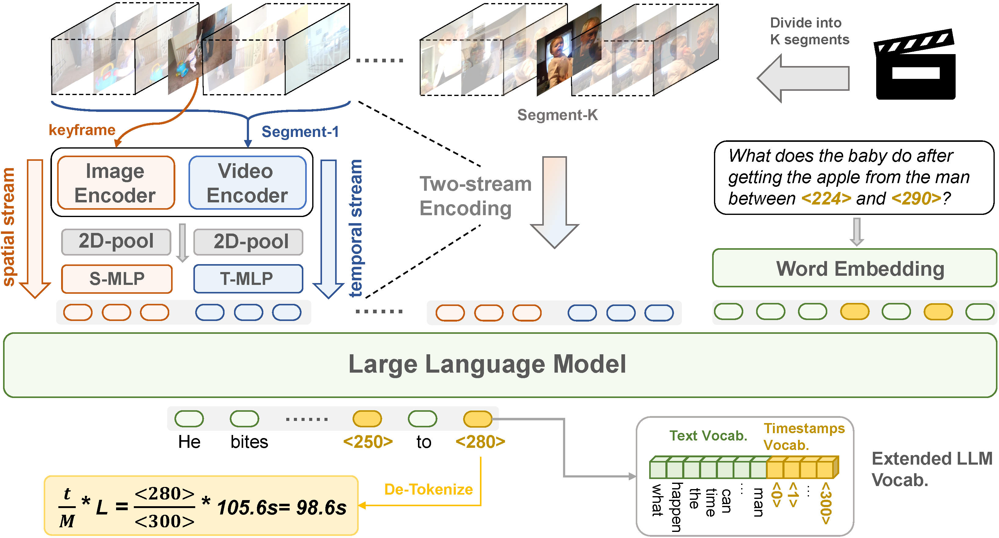

# Grounded-VideoLLM: Sharpening Fine-grained Temporal Grounding in Video Large Language Models
This is the official repository for the video large langauge model : **Grounded-VideoLLM**, a Video-LLM adept at fine-grained temporal grounding. **Grounded-VideoLLM** not only excels in grounding tasks such as temporal sentence grounding, dense video captioning, and grounded VideoQA, but also shows great potential as a versatile video assistant for general video understanding.

<div align="center">
  
</div><br/>

We sharpen our model by incorporating 

- An additional temporal stream to encode the relationships between frames. 

- Discrete temporal tokens enriched with specific time knowledge to represent timestamps. 

- A multi-stage training scheme, beginning with simple video-captioning tasks and progressively introducing video temporal grounding tasks of increasing complexity. To further enhance the temporal reasoning capability, we also curate a grounded VideoQA dataset by an automatic annotation pipeline. 


## Install
1. Clone this repository and navigate to folder
```bash
git clone https://github.com/WHB139426/Grounded-Video-LLM.git
cd Grounded-Video-LLM
```

2. Install Package
```Shell
conda create -n grounded-videollm python=3.10.14
conda activate grounded-videollm
pip install torch==2.1.2 torchaudio==2.1.2 torchvision==0.16.2 torchdata==0.8.0
pip install -r requirements.txt
```

**Some installation suggestions**
- We recommend you to pip install `flash-attn==2.3.3` and run the model with `torch.bfloat16`. If your device doesn't support these, you can skip them and replace the argparse parameter in `inference.py` by replacing `attn_implementation` and `dtype`, which may result in subtle numerical difference.

## Prepare the pretrained weights

Set your own `weight_path` to storage the pretrained weights. The folder should be organized as follows: 
```
├── Grounded-Video-LLM
│   └── inference.py
│   └── models
│   └── mm_utils
│   └── training
│   └── scripts
│   └── ...
├── weight_path
│   └── Phi-3.5-mini-instruct
│   └── Phi-3.5-vision-instruct-seperated
│   └── Phi-3.5-vision-instruct
│   └── ckpt
│   └── internvideo
│   └──...
```
Download the pretrained weights [[🤗HF](https://huggingface.co/WHB139426/Grounded-Video-LLM/tree/main)] in your own `weight_path`. 

## Qucik Start
We give a brief example to run the inference code. We recommend GPUs with 24GB memeroy.
1. replace the parameter `weight_path` in `scripts/inference.sh` with your own weight_path that you set above.
2. run the command `bash scripts/inference.sh` to reproduce the example below:

https://private-user-images.githubusercontent.com/115783170/373608088-69f83fd7-59d2-4105-a766-cd712d14d425.mp4

```
USER: Give you a textual query: "The female host wearing purple clothes is reporting news in the studio". When does the described content occur in the video? Please return the start and end timestamps.

Grounded-VideoLLM: From 15.15 seconds to 25.09 seconds.

USER: Give you a textual query: "A sign written with 'NO TRESPASSING LOITERING DRUGS'". When does the described content occur in the video? Please return the start and end timestamps.

Grounded-VideoLLM: From 107.95 seconds to 113.16 seconds.

USER: Why was the man in green clothes interviewed?

Grounded-VideoLLM: The man in green clothes was interviewed to provide his perspective on the incident and the history of violence in the apartment complex.
```
3. You can change the `prompt_grounding`, `prompt_videoqa`, `video_path` in argparse and run `python inference.py` for your own case.

## Grounded-VideoQA dataset
We provide the Grounded-VideoQA dataset that we annotated with GPT-4o-mini in [[🤗HF](https://huggingface.co/WHB139426/Grounded-Video-LLM/blob/main/G-VideoQA-gpt4o-mini-anno.json)]. You can download the videos following [[ActivityNet](https://activity-net.org/download.html)] and [[QVHighlights](https://github.com/jayleicn/moment_detr)].

## TODO List
- [x] Release the Phi3.5-Vision-Instruct version.
- [ ] Release the LLaVA-Next-LLAMA3-8B version (coming soon).
- [ ] Release the training scripts and datasets.